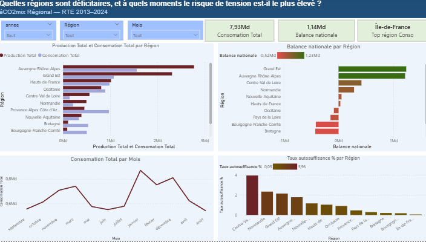
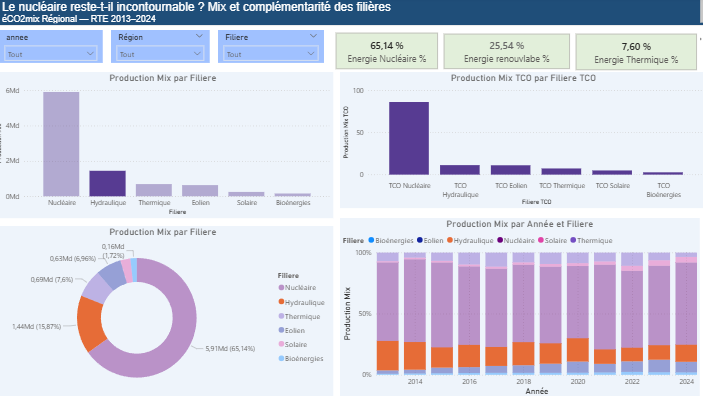

# Analyse du Mix Énergétique Régional Français (2013-2024)

Le nucléaire reste-t-il incontournable ? Quelles régions sont déficitaires ?

## Aperçu du projet

Ce projet analyse 2,7 millions d'observations de production et consommation
électrique régionale en France, de janvier 2013 à janvier 2026.

## Dashboard Power BI

### Page 1 - Mix énergétique

- Nucléaire : 65,14% de la production totale
- Renouvelables : 25,54%
- Thermique : 7,60%

### Page 2 - Régions déficitaires

- Grand Est et Auvergne-Rhône-Alpes : plus grands producteurs nets
- Île-de-France et Bretagne : déficitaires

## Technologies

- Python (Pandas, NumPy, Matplotlib, Seaborn)
- Power BI
- Google Colab

## Auteur

Safae - Formation Data Analyst (Liora) - Master Informatique 
